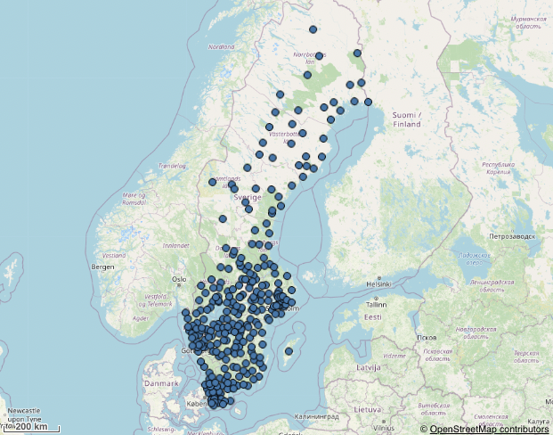

## Examples

[Point layer examples](./point-layer.md)
[Geodata layer examples](./geodata-layer.md)

### Map with a tms geodata layer and point layer



```js
nuked.render({
  type: 'map',
  element,
  properties: {
  gaLayers: [
    {
      type: 'PointLayer',
      qHyperCubeDef: {
        qDimensions: [
          {
            qDef: {
              qFieldDefs: [
                'Municipality'
              ],
            },
            qAttributeExpressions: [
              {
                qExpression: 'SE',
                id: 'locationCountry'
              }
            ],
          }
        ],
        qMeasures: [],
        qInitialDataFetch: [
          {
            qLeft: 0,
            qTop: 0,
            qWidth: 1,
            qHeight: 10000
          }
        ],
      },
      size: {
        value: 10,
      },
      color: {
        mode: 'primary',
        paletteColor: {
          index: 6,
          color: '#4477aa'
        },
      },
      locationOrLatitude: {
        key: 'Municipality',
        type: 'expression'
      },
      id: 'tWTdanX'
    },
    {
      type: 'GeodataLayer',
      dataType: 'tms',
      tms: {
        url: 'https://tile.openstreetmap.org/${z}/${x}/${y}.png',
        attribution: ,
        auto: true,
        tileSize: 256,
        tileWidth: 40075016,
        tileHeight: 40075016,
        originLeft: -20037508,
        originTop: 20037508
      },
      id: 'bKgjAA'
    }
  ],
  mapSettings: {
    showScaleBar: true,
  },
  },
});
```
