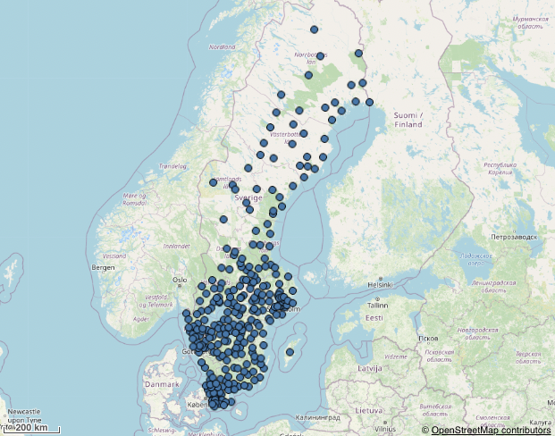
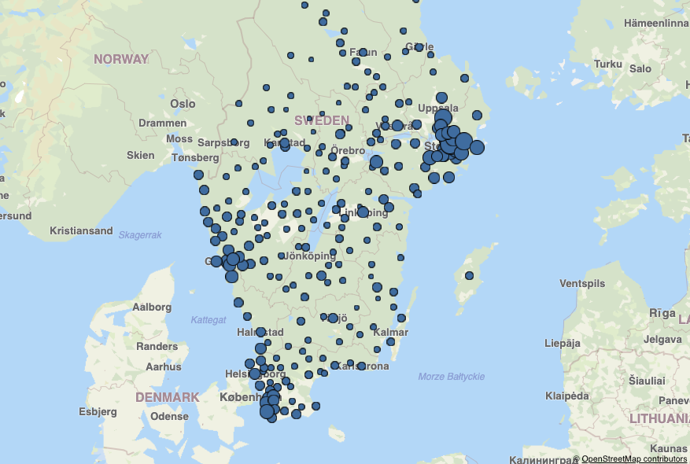
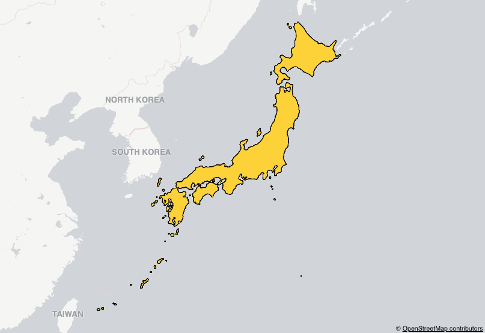

## Examples

---

- [Point and geodata layer](#point-and-geodata-layer)
- [Point layer with size by expression](#point-layer-with-size-by-expression)
- [Area layer single country](#area-layer-single-country)

---

### Point and geodata layer



Here we have a point layer that uses a field to specify its coordinates and a geodata layer for the background map.

```js
nuked.render({
  type: 'map',
  element,
  properties: {
  gaLayers: [
    {
      type: 'PointLayer',
      qHyperCubeDef: {
        qDimensions: [
          {
            qDef: {
              qFieldDefs: [
                'Station'
              ],
            },
            qAttributeExpressions: [
              {
                qExpression: 'coordinates',
                id: 'locationOrLatitude'
              },
            ],
          }
        ],
        qMeasures: [],
        qInitialDataFetch: [
          {
            qLeft: 0,
            qTop: 0,
            qWidth: 1,
            qHeight: 10000
          }
        ],
      },
      size: {
        value: 10,
      },
      color: {
        mode: 'primary',
        paletteColor: {
          color: 'blue'
        },
      },
      id: 'tWTdanX'
    },
    {
      type: 'GeodataLayer',
      dataType: 'tms',
      tms: {
        url: 'https://tile.openstreetmap.org/${z}/${x}/${y}.png',
        attribution: ,
        auto: true,
        tileSize: 256,
        tileWidth: 40075016,
        tileHeight: 40075016,
        originLeft: -20037508,
        originTop: 20037508
      },
      id: 'bKgjAA'
    }
  ],
  mapSettings: {
    showScaleBar: true,
  },
  },
});
```

### Point layer with size by expression



In this example we are connected to one of Qlik's cloud server to utilize the location lookup. The libraryItem for locationOrLatitude is a municipality field. We use a locationCountry expression to only lookup municipalities in Sweden.

```js
nuked.render({
  type: 'map',
  element,
  options: {
    configuration: {
      serverUrl: 'https://maps.qlikcloud.com',
      serverKey: ... ,
    },
  },
  properties: {
    gaLayers: [
      {
        type: 'PointLayer',
        qHyperCubeDef: {
          qDimensions: [
            {
              qDef: {
                qFieldDefs: [
                  'id'
                ],
              },
              qAttributeExpressions: [
                {
                  qExpression: 'SE',
                  id: 'locationCountry'
                },
                {
                  qExpression: 'Avg(Price)',
                  id: 'size'
                }
              ],
              qAttributeDimensions: [
                {
                  qLibraryId: 'jqZDM',
                  id: 'locationOrLatitude'
                },
              ],
            }
          ],
          qMeasures: [],
          qInitialDataFetch: [
            {
              qLeft: 0,
              qTop: 0,
              qWidth: 1,
              qHeight: 10000
            }
          ],
        },
        size: {
          autoRadiusValueRange: true,
          rangeValues: [5, 25],
          expression: {
            key: 'Avg(Price)',
            type: 'expression',
          },
        },
        color: {
          mode: 'primary',
          paletteColor: {
            color: '#f8981d'
          },
        },
        id: 'tWTdanX'
      }
    ],
    mapSettings: {},
  },
});
```

### Area layer single country



Here we put Japan as the dimension and use the location lookup by being connected to Qlik's cloud server to retrieve the polygon. As we don't specify a locationOrLatitude expression the map will use the dimension as the location.

```js
nuked.render({
  type: 'map',
  element,
  options: {
    configuration: {
      serverUrl: 'https://maps.qlikcloud.com',
      serverKey: ... ,
    },
  },
  properties: {
    gaLayers: [
      {
        type: 'AreaLayer',
        qHyperCubeDef: {
          qDimensions: [
            {
              qDef: {
                qFieldDefs: [
                  "'=Japan'"
                ],
              },
              qAttributeExpressions: [],
            }
          ],
          qMeasures: [],
          qInitialDataFetch: [
            {
              qLeft: 0,
              qTop: 0,
              qWidth: 1,
              qHeight: 10000
            }
          ],
        },
        color: {
          mode: 'primary',
          paletteColor: {
            color: '#f8981d'
          },
        },
        id: 'tWTdanX'
      }
    ],
    mapSettings: {
      baseMap: 'pale',
      showScaleBar: true,
    },
  },
});
```
