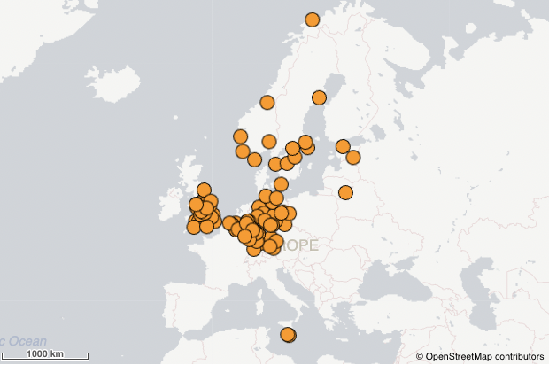

## Point Layer

A point layer overlays individual locations on a map, representing them with shapes.

Point layers use circular bubbles. The size of the points are fixed and can be colored with a single color.

### Examples

### Map with a point layer



```js
nuked.render({
  type: 'map',
  element,
  options: {
    configuration: {
      serverUrl: ... ,
      serverKey: ... ,
    },
  },
  properties: {
    gaLayers: [
      {
        type: 'PointLayer',
        qHyperCubeDef: {
          qDimensions: [
            {
              qDef: {
                qFieldDefs: [
                  'id'
                ],
              },
              qAttributeExpressions: [
                {
                  qExpression: 'latitude',
                  id: 'locationOrLatitude'
                },
                {
                  qExpression: 'longitude',
                  id: 'longitude'
                }
              ],
            }
          ],
          qMeasures: [],
          qInitialDataFetch: [
            {
              qLeft: 0,
              qTop: 0,
              qWidth: 1,
              qHeight: 10000
            }
          ],
        },
        size: {
          radiusMin: 4,
          radiusMax: 12,
        },
        color: {
          mode: 'primary',
          paletteColor: {
            index: 9,
            color: '#f8981d'
          },
        },
        locationOrLatitude: {
          key: 'latitude',
          type: 'expression'
        },
        id: 'tWTdanX'
      }
    ],
    mapSettings: {
      showScaleBar: true,
    },
  },
});
```
